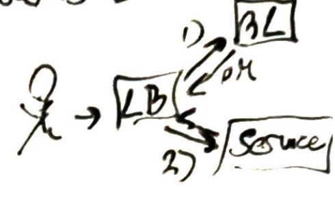
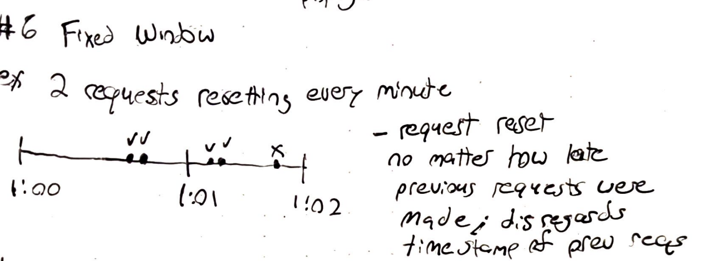
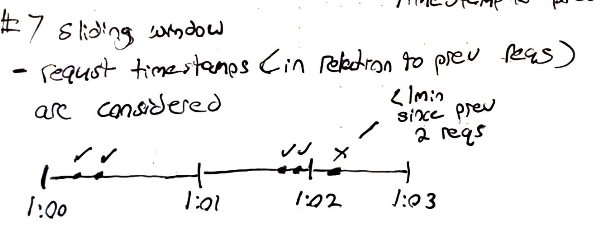
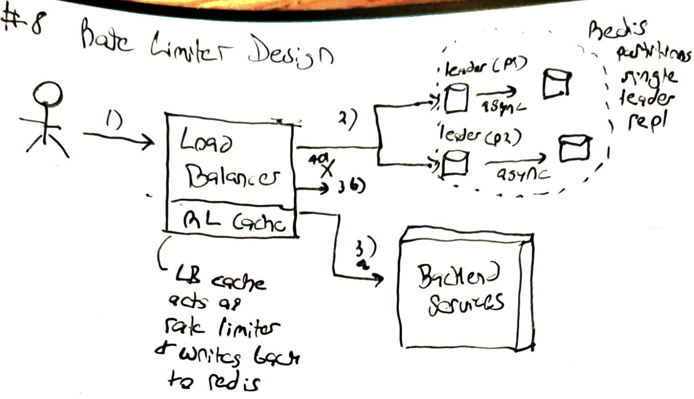

# Rate Limiter Design

Requirements:
- rate limiter should stop users from submitting too many requests while introducing minimal latency
- support a variety of different rate limiting techniques

Estimations:
- 1B users per service
- 20 services
- userId ~ 8bytes, requests ~ 4bytes
- around 240 GB of data => 1B * 20 services * (8+4 bytes of data)
- if we're going with an in memory solution, we'll need to partition our data since 240 GB of data on disk may be too large/slow

## What we'll we rate limit on
1. UserId
  - userId is easy to track
  - bad users will be blocked, but users can create many accounts
  - not all services need auth; there may not be a concept of a user for every service

2. IP Address
  - easy to track and no need for a sign in
  - ip rate limiting prevents users from having multiple accounts
  - good actors on same network will be throttled 

3. Hybrid approach?
  - limit based on userId, when available, otherwise the IP

## Interface
- we will support multiple implementations of the interface
- boolean rate limit (long userId, string ip addr, string service name, date request time); should return true if we limit

## Placement
- the amount of data we need to store is too large to keep on a load balancer

`Option 1` - Perform Rate limiting locally on each service

  

Pros:
- no extra network calls required
- fewer types of components to manage

Cons:
- will use up server network bandwidth if we get spammed
- our ability to scale the rate-limiter and service/app are tightly coupled

`Option 2` - Use a dedicated distributed rate limiter
- we can create a rate-limiting service/layer and work with an API Router

  

Pros:
- shields application servers from large bursts of traffic
- scales independently 

Cons:
- introduces extra network calls (increases latency, but we can cut down on this by caching)

## Rate Limiter Caching
- we can implement a `write-back cahce` on our load balancers when users reach a certain threshold to cut down on extra network calls

  

  - this assumes a single load balancer
  - the LB will essentially act as the rate limiter
  - the LB updates user requests and writes back to the RL asynchronously

## Rate Limter Storage
- we want r/w requests to be as fast as possible, and we don't have that much data to store per request
- disk will be to slow
- `Redis` or `Memcached` will be good choices 
  - they take advantage of existing data structures
  - fairly easy to setup replication 

## Replication Choice
- we need the rate limiter to be fault tolerant, because if it goes down, we won't be able to forward requests to the backend services

**Multi-Leader/Leaderless replication?**
- Could increase write throughput because writes can go to any replica, yields lower write load on each system
- we have to wait for anti-entropy for counts to synchronize (could us a CRDT - prevents write conflicts when syncing)

  

**Single Leader Replication**
- counts of requests on leader will always be accurate and up to date, all reads can be done on leader (reads from followers may not be accurate due to `asynchronous replication`)
- the leader will have increased read traffic, but a sufficient number of `partitions` should be able to handle the traffic

  

## Algorthims

**Fixed window**

  

- `fixed window` algorithm will allow a certain number of requests within a window without considering the time between individual requests
- the number of requets is reset after the expiration of the window

**Sliding window**

  

- `sliding window` algorithm will take into consideration the time between requests
- uses linked list with size of the number of allowed requests; when enough time has passed, a request is removed from the list so that another can be made within the window of the last request

## Concurrency Considerations
- we have to potential for race conditions and lost updates if threads are accessing the counter at the same time; we need `distributed locking` or `single threaded` processes to counteract this

- with the sliding window implementation its possible to have concurrent process create different linked list entries that all point to the same previous node (we'd definitely need locking to fix this)

**Final Design**

